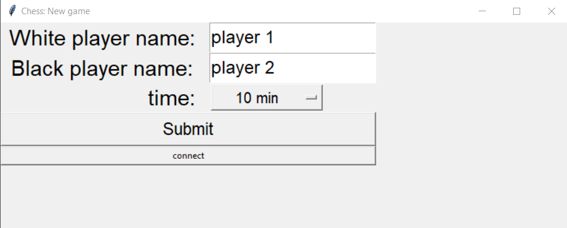
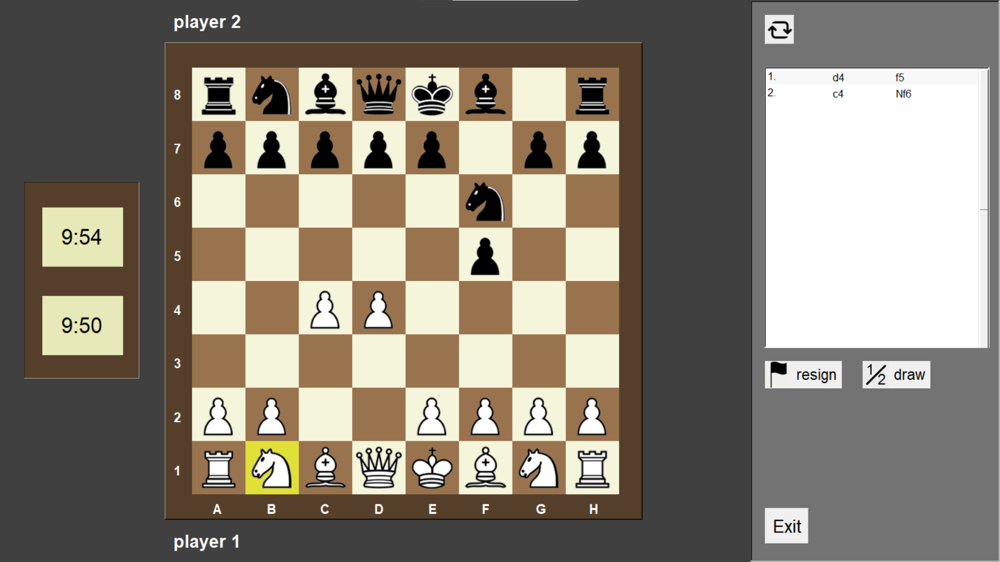
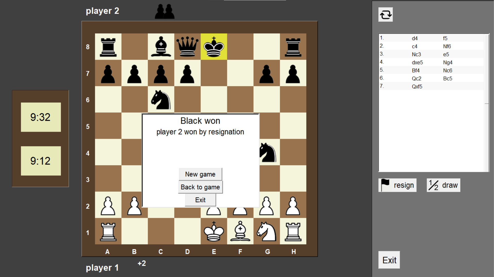

# ChessLAN

I love chess so in high school I decided to create a chess game in Python. I meant for it to be playable between 2 players on LAN but decided to keep it simple and the 2 people can play it on the same screen only.

It has all the rules of chess implemented. The player can see their previous moves in the classical chess notation. You can resign, draw the game, flip the board and it contains clocks. (made in 2017)

## Requirements
 - tkinter
 - PIL

## Credits

- [Tomáš Žilínek](https://www.linkedin.com/in/tomaszilinek)

